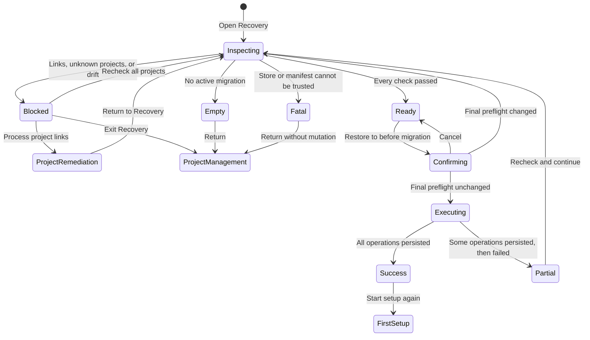

# Global Recovery overview — complete flow contract

Status: selected direction under full-flow review

Selected visual direction: A, `recovery-global-overview-v1.png`

The product owner selected the full-window global overview on 2026-08-12. This document resolves
the expensive-to-change flow and data decisions before production React or registry work begins.

Key high-fidelity states:

- `recovery-overview-01-checking-v1.png`
- `recovery-overview-02-blocked-v1.png`
- `recovery-overview-03-link-details-v1.png`
- `recovery-overview-03b-project-handoff-v1.png`
- `recovery-overview-04-ready-v1.png`
- `recovery-overview-05-confirm-v1.png`
- `recovery-overview-06-running-v1.png`
- `recovery-overview-07-success-v1.png`
- `recovery-overview-08-partial-v1.png`
- `recovery-overview-09-empty-v1.png`
- `recovery-overview-10-fatal-v1.png`

## 1. Product promise

Recovery is one rollback of the first migration. It restores every still-quarantined original user
entry, removes every unchanged Store import created by that transaction, and returns Habitat to
first setup. It never asks the user to choose Skills and never deletes project links implicitly.

The page has no project sidebar and no current-project scope. Projects appear only as members of a
global safety audit.

## 2. Authoritative audit set

The backend must build the audit set itself. Frontend local storage or a caller-supplied array is
not proof of completeness.

The set is the canonical-path union of:

1. every active record in a durable backend-owned managed-project registry; and
2. every project root referenced by a valid Store-owned `*.project.json` transaction whose source
   paths intersect the first-migration imports being rolled back.

Historical transaction roots remain audit dependencies even if the project is no longer shown in
the normal project list. This prevents “forget project” from becoming a way to delete Store sources
while an offline project still contains links to them.

For each candidate, Recovery validates the registry/manifest boundary, canonical path, recorded
filesystem identity when available, and all Habitat-managed adapter containers. A missing,
unmounted, unreadable, replaced, or otherwise unverified project produces `unknown`, not `safe`.
Unknown blocks the entire rollback.

Recovery does not scan the whole disk. It also does not offer “remove this unavailable project and
continue”; the user must make the project readable again. Registry cleanup can remain a separate
project-management action after Recovery is no longer pending.

## 3. Navigation contract

- Entry: sidebar `恢复` opens a full-window global surface and immediately starts a fresh audit.
- Exit before execution: `返回项目管理` discards the in-memory inspection token and changes no
  files. Re-entry always runs a new audit.
- Project-link remediation: `处理链接` opens the existing project workspace, filtered to the
  affected Skills and with a quiet `返回恢复检查` context bar. The user explicitly creates the
  normal removal draft, reviews it, and applies it through the existing project transaction flow.
- Return from remediation: Recovery runs a complete audit again; it never trusts the prior page or
  removes links automatically.
- While rollback is mutating files, navigation and cancellation are disabled. A native close/quit
  attempt warns that the operation is in progress. If the process still exits, the persisted
  `rolling_back` manifest is detected on next launch and Recovery becomes the mandatory resume
  surface.

## 4. State machine

## 5. Required states and user paths

| ID | State | What the user sees | Available actions | File effect |
|---|---|---|---|---|
| R0 | Entering / inspecting | Stable shell, project coverage progress, current check label | Return to project management | None |
| R1 | No recoverable transaction | “没有需要恢复的首次迁移” and why Recovery is unavailable | Return; start first setup when setup metadata is stale | None |
| R2 | Blocked overview | Every audit project, coverage, related-link count, unknown count, grouped blocker summary | Recheck; inspect blockers; remediate a project; return | None |
| R3 | Link details | Exact project, adapter container, Skill name, and path for every related link | Open the corresponding project workspace; copy path; back | None |
| R4 | Project remediation handoff | Existing project Skills UI filtered to affected Skills, with Recovery context bar | Make explicit removal draft; review/apply; return to Recovery | Only the confirmed project transaction |
| R5 | Unavailable project | Project row stays in the global table with an unknown result | Reconnect volume/fix permissions; reveal expected path; recheck | None |
| R6 | System safety blocker | Store/import/recovery/original path or manifest integrity problem, separated from project blockers | Copy diagnostics; reveal safe parent folder where possible; return | None |
| R7 | Ready | 100% coverage, zero related links, exact restore/remove counts | Recheck; return; open final confirmation | None |
| R8 | Final confirmation | One destructive dialog with exact transaction, two effects, and explicit non-effects | Cancel; `确认恢复到迁移前` | None until confirm |
| R9 | Executing | Non-cancellable progress, persisted stage, completed/total counts when available | No workflow action | Exact rollback operations, persisted after each item |
| R10 | Success | Restored and removed totals, zero project links changed, next lifecycle state | `重新开始设置` | Already complete |
| R11 | Final-preflight drift | Inline notice explaining the plan changed and the whole operation stopped before mutation | Return to updated audit | None |
| R12 | Partial execution failure | Exact completed and remaining operations, failed path, recovery instruction | Recheck and continue remaining work; copy/reveal report | Some exact operations may already be persisted |
| R13 | Relaunch during rollback | Recovery opens before normal project UI and explains an unfinished persisted rollback | Inspect; continue when safe; view report | None until continue |

## 6. Blocker taxonomy and remediation

### Project blockers

- `managed_project_link_active`: show the link under its project; hand off to the existing project
  change flow. Never offer an inline delete action.
- project missing/unmounted/unreadable: show the recorded path and why the result is unknown. The
  only recovery-safe remedy is to make that recorded project readable and recheck.
- project identity changed: do not silently bind the old record to a different directory. Show
  “项目位置已被替换或改道” and require a separately verified project relocation flow.

### Transaction blockers

- original destination occupied;
- recovery entry missing, replaced, unreadable, or fingerprint/link-text drifted;
- Store import missing, replaced, outside Store, or fingerprint drifted;
- Store identity/path drift;
- unknown Agent user root;
- multiple active first-migration transactions;
- invalid, unreadable, symlinked, or boundary-crossing manifest/container.

These appear in a separate “迁移事务需要人工检查” group so the project table never suggests the
user can solve them by editing a project. Retryable permission errors expose `重新检查`; integrity
errors expose diagnostics but no broad automatic repair.

## 7. Confirmation and execution

The final confirmation uses a danger-styled primary action, not the normal coral action. It states:

- restore `N` original user entries to their recorded paths;
- remove `M` unchanged Store imports created by transaction `{id}`;
- do not modify Agent settings;
- do not automatically change any project link;
- preserve the managed-project registry and transaction history as dormant Habitat metadata.

Typing a phrase or selecting a redundant checkbox is unnecessary because the user has already
passed a dedicated global audit and a separate confirmation. Confirm triggers one final backend
rebuild of the authoritative audit set. The command executes only if the transaction id and complete
audit revision still match.

Rollback persists after each restored entry and removed import. A recoverable retry only continues
operations still marked `quarantined` or `imported`; it never repeats completed operations. The UI
must not label a partial failure as “no files changed.”

## 8. Post-success lifecycle

- Mark the first-migration manifest `rolled_back`.
- Clear the active Recovery session and the frontend setup-complete flag.
- Keep the selected Store path as the suggested path for the next setup, subject to normal Store
  validation.
- Preserve managed-project records and project transaction history, but keep them dormant until a
  new first migration completes. No links should remain to removed imports because that was a
  precondition.
- Show a completion screen before routing to first setup so the result is observable and accessible.

## 9. Proposed backend response surface

`RecoveryInspection` needs more than the current aggregate `RecoveryPlan`:

- `transaction`: id, state, created/updated time, total/current import and recovery counts;
- `auditRevision`: backend-generated digest covering the transaction plus the complete project set;
- `coverage`: expected, inspected, passed, blocked, unknown;
- `projects[]`: stable registry id, root, provenance (`registry`, `project_transaction`, or both),
  accessibility/identity result, related links grouped by adapter target;
- `transactionBlockers[]`: structured code, retryability, path, message, recovery instruction;
- `ready`: true only when coverage is complete, related links are zero, and transaction blockers are
  empty;
- `resume`: completed and remaining operation counts when state is `rolling_back`.

`execute_recovery_command` should accept the transaction id and audit revision, rebuild all inputs,
and reject any mismatch before mutation.

## 10. Interaction, accessibility, and responsive requirements

- Project rows are a semantic table at desktop sizes; at narrow widths each row becomes a labeled
  disclosure card without horizontal scrolling.
- Inspection progress uses a polite live region; final success and execution failure use an assertive
  announcement once, not on every item.
- Every status includes text or an icon in addition to color. Paths are selectable and copyable.
- Keyboard order follows header, recheck, project table, blocker details, recovery summary, final
  action. Dialog focus is trapped and returns to the triggering button on cancel.
- `prefers-reduced-motion` removes progress interpolation and panel transitions.
- The executing state retains layout and button width; it never converts into an indeterminate blank
  screen.

## 11. Verification surface

Before production UI is done, fixtures must prove:

1. registry-only, history-only, overlapping, removed-from-frontend, and duplicate canonical project
   records produce one complete audit set;
2. an offline historical project blocks Recovery and cannot be bypassed by deleting local UI state;
3. related links in `.agents`, `.claude`, and `.trae` are grouped correctly and unrelated links/files
   remain untouched;
4. navigation away, cancellation, and a stale final preflight produce zero file mutations;
5. project remediation uses the existing project transaction and a return causes a full recheck;
6. success restores exact identities/link text/fingerprints and transitions to first setup;
7. an injected failure after several operations reports partial state and safely resumes only the
   remainder after restart;
8. every visual state passes the `DESIGN.md` section 14 checklist at 1440×1024 and a MacBook-sized
   viewport, with keyboard and screen-reader state verified;
9. `npm run check` passes and all mutable tests use temporary fixtures.

## 12. Explicit non-goals

- whole-disk project discovery;
- automatic deletion of project links from Recovery;
- bypassing an inaccessible historical project by forgetting it;
- manual editing or automatic repair of transaction manifests;
- permanent deletion of Recovery history;
- modifying Agent configuration.
